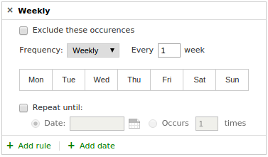

django-recurrence
*****************

.. toctree::
   :maxdepth: 2

django-recurrence is a utility for working with recurring dates in
Django.

It provides:

- Recurrence/Rule objects using a subset of rfc2445 (wraps
  ``dateutil.rrule``) for specifying recurring date/times;
- ``RecurrenceField`` and ``RecurrenceModelField`` for storing
  recurring datetimes in the database (text/one-to-one respectively);
- a JavaScript widget.

Installation
============

Firstly, you'll need to install ``django-recurrence`` from PyPI. The
easiest way to do this is with pip::

    pip install django-recurrence

Then, make sure ``recurrence`` is in your ``INSTALLED_APPS`` setting:

.. code-block:: python

    INSTALLED_APPS = (
      ...
      'recurrence',
    )

django-recurrence includes some static files (all to do with
rendering the JavaScript widget that makes handling recurring dates
easier). To ensure these are served correctly, you'll probably want
to ensure you also have ``django.contrib.staticfiles`` in your
``INSTALLED_APPS`` setting, and run::

    python manage.py collectstatic

Currently, django-recurrence supports Python 2.6, Python 2.7, and
Python 3.3. Python 3 support is experimental (we run our tests
against Python 3, but have not yet tried it in production).

django-recurrence works with Django 1.5 and Django 1.6. Support for
Django 1.7 (and any following releases) is planned.

Usage
=====

Once you've installed django-recurrence, the most common use case
is adding a field to a model, which can be done like this:

.. code-block:: python

    from recurrence.fields import RecurrenceField

    class Course(models.Model):
        title = models.CharField(max_length=200)
        recurrences = RecurrenceField()

If you use the ``Course`` model in Django's administrative interface,
or in any forms, it should be rendered with a pretty form field,
which makes selecting relatively complex recurrence patterns easy.

Development
===========

Contributions to django-recurrence are very welcome - whether in the
form of bug reports, feature requests, or patches.

Bug reports and feature requests are tracked on our `GitHub issues
page
<https://github.com/django-recurrence/django-recurrence/issues>`_.

If you want to make changes to django-recurrence, you'll need to fork
our GitHub repository, make any changes you want, and send us a pull
request. Feel free to `file an issue
<https://github.com/django-recurrence/django-recurrence/issues>`_ if
you want help getting set up.

Running the tests
-----------------

The easiest way to run the tests is to run::

    make testall

from the root of your local copy of the django-recurrence
repository. This will require that you have tox installed. If you
don't have tox installed, you can install it with ``pip install
tox``. Running all the tests also requires that you have Python 2.6,
Python 2.7, and Python 3.3 installed locally.

If that sounds like too much work, feel free to just run tests on
whatever your local version of Python is. You can do this by
running::

    pip install -r requirements_test.txt  ! You only need to run this once
    make test

If you want to see what our code coverage is like, install everything
from ``requirements_test.txt``, then run::

    make coverage

Working with the documentation
------------------------------

Our documentation is written with Sphinx, and can be built using::

    make html

from our ``docs`` directory. You'll need to have Sphinx installed for
this to work.

Changelog
=========

1.1.0
-----

* Added experimental Python 3 support;
* Added extensive test coverage (from 0% to 76%);
* Added documentation (including this changelog);
* Find list of fixed bugs.
